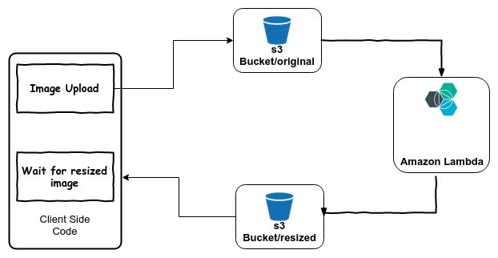

# image-lambda-

### author Nassir Abegaz

## overview 
- create s3 Buckets for file storage.
- upload an image to resize.
- Deploying a Node.js Lambda Function that conects to s3.
- Auto Deploying to AWS through GitHub.
  

  ## Feature Tasks

- A user should be able to upload an image at any size, and have both the original size and a thumbnail size
- When an image is uploaded to your S3 bucket, it should trigger a Lambda function which must;
    - Create a 50x50 pixel thumbnail version of that image
    - Save it to another S3 bucket.
    - It should do so with a predictable naming convention, so that your server and/or frontend know where that thumbnail image will be.
  
## set-up 
npm init -y 
npm install dependancies 
eb init / initialize elasticbeanstalk .
zip -r lambda-function.zip (zip a lambda function)

## Solution

Here is the description of workflow

- Create two folders in your S3 bucket : original & resized.
- Create a lambda function and add this lambda function to S3 trigger, so that whenever any image will be uploaded to S3, this trigger will be executed and lambda function will run.
- Upload images from you client side to original folder of S3 Bucket.
- Once image is uploaded lambda will run to do the processing on image (Re-size/optimize ) and will save this processed(re-sized) image to re-sized folder of the bucket .
- Keep polling the resized folder from client side to get resized image. (Remember we upload the original image to “original” folder & get the resized image from “resized” folder)
<!-- Embedded whiteboard image -->

[reference](https://docs.aws.amazon.com/lambda/latest/dg/with-s3-tutorial.html)

### Code

- There are two ways to write code for lambda :

- Inline Code .
- Write on local and upload source code in .zip file with all dependencies.

source : https://www.linkedin.com/pulse/re-sizing-optimizing-images-go-using-amazon-lambda-s3-chauhan/
